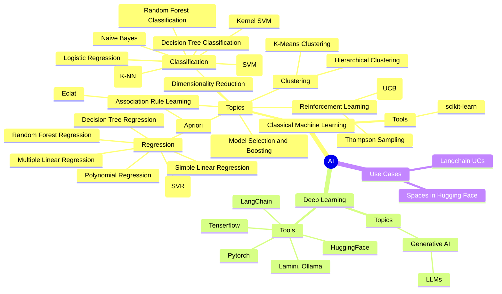

# Let's keep Track about what is happening in the World of AI

This video covers how the bridge pattern works and why it's useful. To spice things up, I'm going to deviate from the classic definition of the pattern from the Gang-of-four book (which is already quite powerful) and show you a couple of things you can do in Python to shorten the code and at the same time allow for extra flexibility.

# Mind Overview

## Algorithms layer

## Data layer

## Statistics